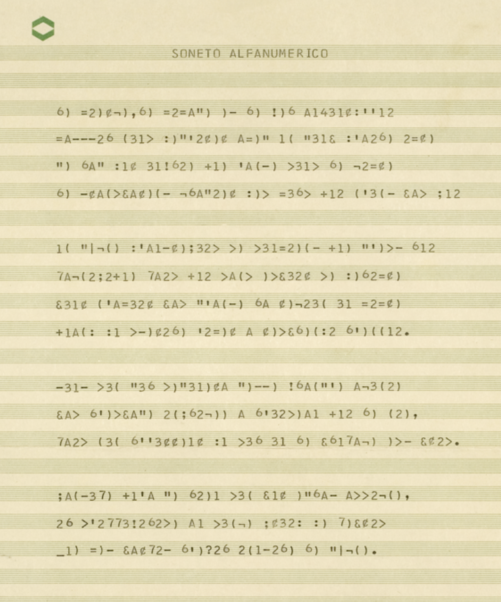
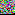
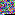

# Soneto Alfanumérico

Reconstrução, decifração e documentação do **Soneto Alfanumérico**, de
**Erthos Albino de Souza** — publicado na revista *Código* n.º 1 (Salvador, BA,
1974), uma cifra de substituição alfanumérica aplicada ao soneto de Stéphane
Mallarmé *"Le vierge, le vivace et le bel aujourd'hui"* (1885).

Este repositório contém o scan original, nossa transcrição, o algoritmo em
Ruby que reproduz a cifra, e a documentação completa do processo — incluindo
a alusão literária de Mallarmé (o trocadilho *cygne/signe*, cisne/signo) que
parece ter motivado a escolha do poema.



<br>
<sub>Erthos Albino de Souza (1932–2000)</sub>

➜ **[Leia a explicação completa](https://rafapolo.github.io/erthos)** (GitHub Pages
deste repositório — ou abra [`index.html`](./index.html) direto no navegador).

## Conteúdo

| Arquivo | O que é |
|---|---|
| [`original.png`](./original.png) | Scan da página publicada em *Código* n.º 1 (1974). |
| [`poema.md`](./poema.md) | Transcrição do poema cifrado, lado a lado com o soneto de Mallarmé. |
| [`DECIFRACAO.md`](./DECIFRACAO.md) | Documentação completa: quem foi Erthos, o processo de decifração linha a linha, a tabela de substituição, os resultados e a alusão ao cisne/signo de Mallarmé. |
| [`soneto_alfanumerico.rb`](./soneto_alfanumerico.rb) | Algoritmo em Ruby (`encode`/`decode`) que reproduz a cifra e verifica o resultado contra a página publicada. |
| [`index.html`](./index.html) | Página única que reúne tudo isso visualmente. |
| [`poema-original.steganos.png`](./poema-original.steganos.png), [`alfanumerico.steganos.png`](./alfanumerico.steganos.png) | Os dois poemas (o de Mallarmé e o de Erthos) re-codificados como imagem, com [`steganos`](https://github.com/rafapolo/steganos) — nossa própria camada de poesia codificada, em homenagem ao gesto de Erthos. Gerados com [`steganos_pure.rb`](./steganos_pure.rb) (reimplementação do algoritmo original em Ruby puro, sem dependências). |

## O achado, resumido

Não é uma permutação embaralhando a ordem das letras, como a fortuna crítica
sugeria vagamente ("tradução criptográfica", "base permutatória") — é uma
**cifra de substituição monoalfabética**: cada letra do francês (sem acento,
maiúscula = minúscula) sempre vira o mesmo símbolo, em todo o poema. A tabela
foi reconstruída por alinhamento manual, verso a verso, entre o soneto de
Mallarmé e a transcrição do scan, e confirmada algoritmicamente:

```
$ ruby soneto_alfanumerico.rb
 1  100.0%  Le vierge, le vivace et le bel aujourd'hui
 ...
10   97.3%  Par l'espace infligée à l'oiseau qui le nie,
        divergencia do impresso: a pagina traz ">" onde a cifra pede "¢"
 ...
14   97.0%  Que vêt parmi l'exil inutile le Cygne.
        divergencia do impresso: a pagina traz "-" a mais
TOTAL: 509/512 caracteres coincidem (99.4%)
```

Detalhes, as duas divergências do impresso e a leitura crítica completa (inclusive por que *este*
soneto de Mallarmé, especificamente, fazia sentido para o experimento — o
trocadilho francês entre *cygne* e *signe*) estão em [`DECIFRACAO.md`](./DECIFRACAO.md).

## Como rodar

```
ruby soneto_alfanumerico.rb
```

Sem dependências além do Ruby padrão (testado em 3.0 e 3.3).

## O que isto é e o que não é

Esta é uma **reconstrução da camada de substituição**, feita por engenharia
reversa a partir da página publicada — não uma recuperação do programa
Fortran/PL-1 original de Erthos, que não sobreviveu (ao menos não nas fontes
disponíveis). Ver a seção 5 de `DECIFRACAO.md` para as limitações honestas
do que conseguimos (e não conseguimos) provar.

## Os dois poemas, como imagem (steganos)




<sub>Esquerda: o soneto de Mallarmé. Direita: o Soneto Alfanumérico de Erthos.
Cada imagem é o próprio texto — comprimido e recodificado pixel a pixel com
<a href="https://github.com/rafapolo/steganos">steganos</a> — não uma
ilustração dele.</sub>

## Fontes

- [Erthos Albino de Souza — Wikipédia](https://pt.wikipedia.org/wiki/Erthos_Albino_de_Souza)
- [Revista Código — Revista Acrobata](https://revistaacrobata.com.br/acrobata/artigo/codigo-revista-codigo-site/)
- [Jorge Luiz Antonio, "Trayectoria de la poesía electrónica en Brasil" — Escáner Cultural](https://revista.escaner.cl/node/714.html)
- Lista completa em [`DECIFRACAO.md`](./DECIFRACAO.md#7-fontes).
